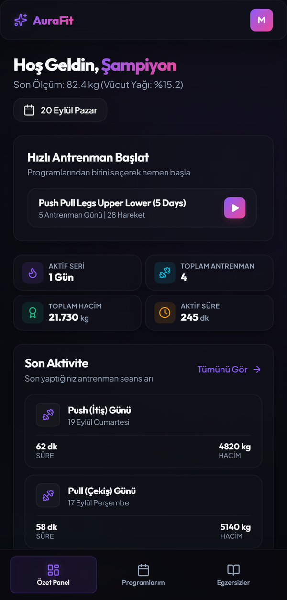
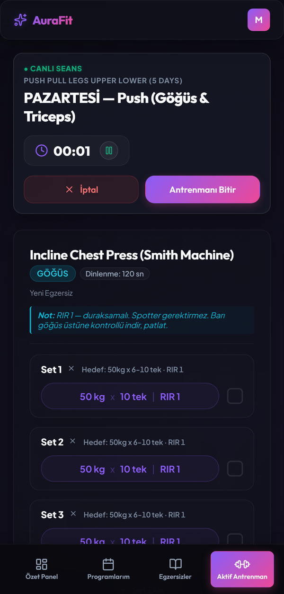
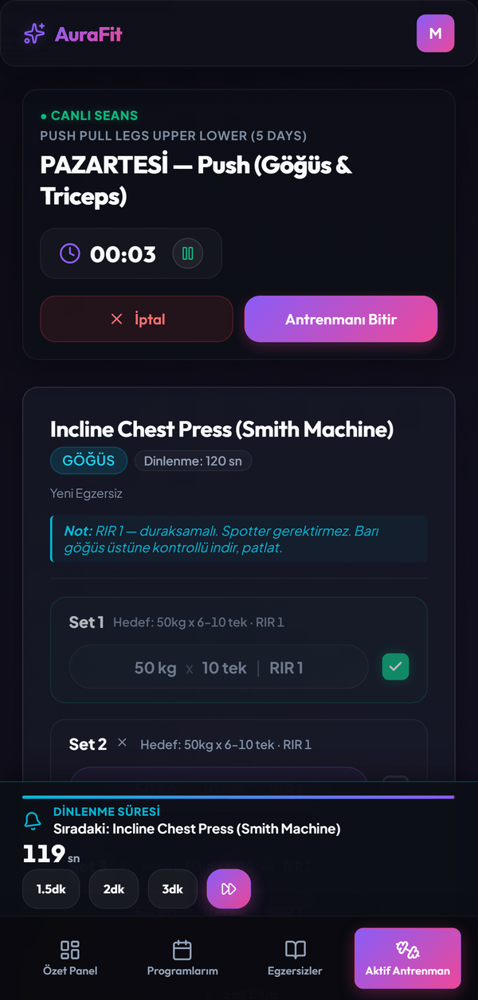
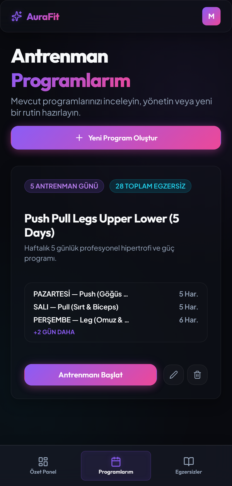
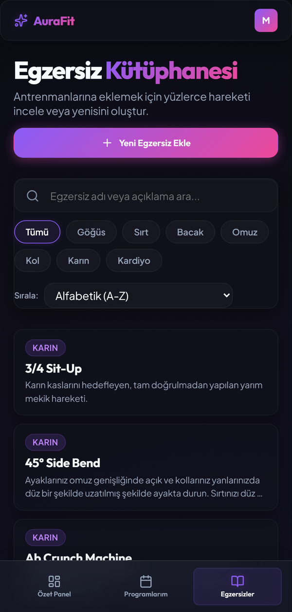

<div align="center">

# AuraFit

**A workout tracker that gets out of your way between sets.**

Plan multi-day training splits, run live sessions with a rest timer that keeps
counting in the background, and let completed weights flow back into next week's
program automatically.

One React codebase → **Web**, **Android**, and **Windows desktop**.

[](LICENSE)
[](https://github.com/eryukselaskar/aurafit-gym/actions/workflows/ci.yml)
[](https://github.com/eryukselaskar/aurafit-gym/releases/latest)

> **Heads up:** the app's interface is currently **Turkish only**. English
> localisation is on the roadmap — see [Localisation](#localisation).

</div>

---

<div align="center">

| Dashboard | Live session | Rest timer |
|:---:|:---:|:---:|
|  |  |  |

| Program builder | Exercise library |
|:---:|:---:|
|  |  |

</div>

---

## What it does

**Program builder** — Build multi-day splits (PPL, Upper/Lower, anything), reorder
exercises by drag and drop, set per-exercise rep ranges, target weights and RIR.
Collapsed cards keep a six-exercise day readable on a phone.

**Live sessions** — Log each set as you go. The rest timer runs as an Android
foreground service, so it keeps counting with the screen off and notifies you when
the set is up. Close the app mid-workout and it resumes exactly where you left off.

**Automatic progression** — When you finish a session, the weights and reps you
actually hit are written back into the program. Next week starts from where you
ended, not from where you planned.

**Personal records** — Estimated 1RM via the Epley formula, with a celebration when
you break one.

**Body metrics** — Weight, body fat and circumference tracking with trend charts,
plus BMI and TDEE calculators.

**Exercise library** — ~1,500 movements built in, plus your own. Search, filter by
muscle group, sort by how often you've trained it.

**Works offline** — Firestore persistent cache plus localStorage. Start as a guest;
sign in with Google later and your local data migrates into the account.

## Download

**[→ Get the latest release](https://github.com/eryukselaskar/aurafit-gym/releases/latest)**

| File | When to use it |
|---|---|
| `AuraFit-Setup-*.exe` | Normal install. Creates shortcuts, no admin rights needed. |
| `AuraFit-Portable-*.exe` | No install. Single file, just double-click. |

Windows 10+ (64-bit). The binaries aren't code-signed, so SmartScreen will warn
you — **More info → Run anyway**.

### What you get in the released build

The released binaries ship **without any Firebase configuration**, on purpose. They
aren't wired to my project, so your data never touches someone else's backend and
nobody else pays for your usage.

**Everything works locally:** programs, live sessions with the rest timer, workout
history, personal records, body metrics and the full exercise library. All of it is
stored on your device.

**What's off:** Google sign-in and cloud sync, so your data doesn't follow you to
another device.

Want sync? Build it yourself with your own Firebase project — it takes a few
minutes, see [Cloud sync](#cloud-sync-optional) below. That way the project is
yours: your quota, your data, your rules.

Android builds aren't published yet; you can build one yourself (see below).

## Built with

React 19 · TypeScript · Vite · Firebase (Auth + Firestore) · Capacitor · Electron ·
Playwright · Vitest

No UI framework — the design system is a set of CSS custom properties in
`src/index.css`.

## Quick start

```bash
npm install
npm run dev          # http://localhost:5188
```

That's it — the app runs without any configuration. Programs, workouts, personal
records and body metrics are all stored on the device, so you can try everything
except cloud sync straight away.

### Cloud sync (optional)

Sign-in and Firestore sync run against **your own Firebase project**, not a shared
one. Copy `.env.example` to `.env` and fill it in:

```bash
cp .env.example .env
```

| Variable | Where to find it |
|---|---|
| `VITE_FIREBASE_*` | Firebase Console → Project settings → Your apps → Web app |
| `VITE_GOOGLE_CLIENT_ID` | Authentication → Sign-in method → Google → Web SDK configuration |

Then enable **Anonymous** and **Google** sign-in providers, and deploy the rules:

```bash
firebase deploy --only firestore:rules
```

For Android, drop your own `android/app/google-services.json` in place and register
your signing certificate's SHA-1 in the Firebase console.

These keys aren't secrets — Firebase web keys ship with the client by design.
Security comes from `firestore.rules`.

| Command | What it does |
|---|---|
| `npm run build` | Type-check + production build |
| `npm run lint` | ESLint |
| `npm test` | Unit tests (Vitest) |
| `npm run test:e2e` | End-to-end tests (Playwright) |
| `npm run electron:start` | Run the desktop app (build first) |
| `npm run electron:build` | Produce the Windows installer + portable exe |

Before the first e2e run: `npx playwright install chromium`

### Android

```bash
npm run build
npx cap sync android
cd android && ./gradlew assembleDebug
```

App id is `com.aurafit.app`. Google Sign-In uses the native
`@capawesome/capacitor-google-sign-in` plugin, so your signing certificate's SHA-1
must be registered in the Firebase console.

### Desktop

`main.cjs` serves `dist/` over `localhost` on a random port rather than `file://`,
because Google Sign-In validates the origin against Firebase's authorised domains.
Sign-in opens `public/desktop-login.html` in the system browser, which posts the
credential back to the local server with a `state` check.

## Notes on the architecture

A few decisions that aren't obvious from the file tree:

- **The exercise catalogue lives in code, not storage.** localStorage only holds
  exercises *you* created. The ~870 kB dataset loads as a separate chunk after
  first paint, so it never blocks startup.
- **The library renders incrementally.** All 1,500 cards used to hit the DOM at
  once (13,716 nodes, a 353,000 px tall page); an IntersectionObserver now pages
  them in 40 at a time.
- **Set targets have one resolution rule.** Exercise-level values override
  set-level ones, and that precedence lives in a single pure function
  (`resolveSetTarget`) used by both the builder and the live session — they used
  to disagree.
- **Regression tests are written against real bugs**, not hypotheticals: horizontal
  overflow at five widths, contrast and focus rings, heading structure, native
  dialogs, crash recovery, offline session completion.

## Localisation

The interface is Turkish only right now. Strings are inline in the components
rather than in a translation catalogue, so English support means extracting them
first. Contributions welcome — open an issue if you want to take it on.

A Turkish version of this README is at [README.tr.md](README.tr.md).

## Contributing

See [CONTRIBUTING.md](CONTRIBUTING.md). Small fixes can go straight to a PR; for
anything larger, open an issue first so we can talk it through.

## License

[MIT](LICENSE) — use it, change it, ship it. Just keep the copyright notice.
